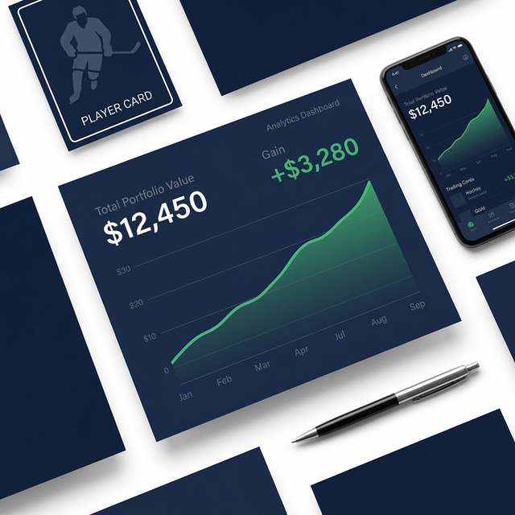
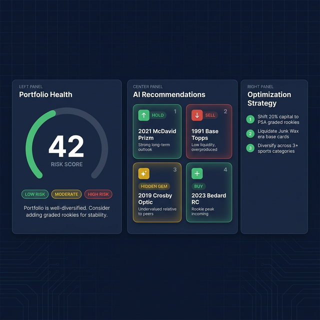
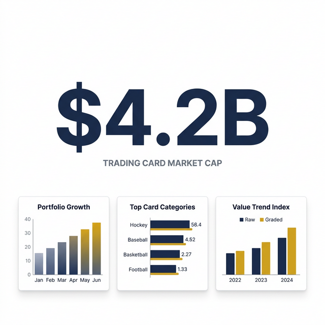

# Tradevalue User Guide

> Your AI-powered trading card portfolio manager. Track your collection, analyze value, and make smarter buying and selling decisions.

---

## Table of Contents

1. [Getting Started](#1-getting-started)
2. [Adding Cards to Your Collection](#2-adding-cards-to-your-collection)
3. [Your Digital Binder (Collection)](#3-your-digital-binder-collection)
4. [Card Details Page](#4-card-details-page)
5. [Portfolio Dashboard](#5-portfolio-dashboard)
6. [AI Market Insights](#6-ai-market-insights)
7. [Smart Notifications & Price Alerts](#7-smart-notifications--price-alerts)
8. [Market Hub](#8-market-hub)
9. [Tips & Best Practices](#9-tips--best-practices)

---

## 1. Getting Started

After signing in, you'll land on the **Portfolio Dashboard**. The main navigation on the left gives you access to every area of the app:

| Navigation Item | What It Does |
| --- | --- |
| **Dashboard** | Your financial summary and top performers |
| **Collection** | Your full digital card binder |
| **Add Cards** (Scanner) | Add cards to your portfolio |
| **Market** | Live auctions, market reports, and card comparison |
| **AI Insights** | Personalized investment advice |
| **Smart Notifications** | Your AI-powered price alert inbox |

---

## 2. Adding Cards to Your Collection

Navigate to **Add Cards** from the sidebar. You have three ways to add cards:

### 📷 Camera Scan (Recommended for Single Cards)

1. Click the **Camera Scan** tab.
2. Upload a clear photo of the **front** of your card.
3. Optionally upload the **back** as well for higher accuracy.
4. The AI will automatically identify the player, year, brand, condition, and grading company.
5. It will also estimate the current market value based on recent eBay sold listings.
6. Review the results and click **Save to Collection**.

> **Pro Tip:** Place your card on a dark, non-reflective surface in good natural light for the best scan results.

### 🔗 eBay URL Import (Quickest for Live Listings)

1. Click the **URL Import** tab.
2. Find an active eBay listing for a card you own or just purchased.
3. Copy the full URL from your browser and paste it into the input field.
4. Click **Import**. The AI will extract all card details, the price, and the listing date automatically.
5. Review and confirm to save.

> **Pro Tip:** Make sure the eBay listing is still **active** (not ended). The import works best when the full card details are mentioned in the item title.

### 📄 CSV Bulk Import (Best for Large Collections)

Use this if you have an existing eBay selling history or a spreadsheet of your cards.

1. Click the **CSV Import** tab.
2. Click the upload area and select your `.csv` file.
3. The system will show you a **preview table** of the parsed rows.
4. Click **"Enhance Rows with AI"** to have the AI automatically fill in the Player, Year, Brand, Condition, Parallel, and Special Features columns from the item titles in your file.
5. Review the enriched preview. The AI cleans up noise keywords (like "L@@K" or emojis) and standardizes card names.
6. Click **Confirm Import** to save all rows to your portfolio.

> **Note:** eBay export CSVs are automatically recognized. Common headers like "Item Title", "Sold Price", and "Sale Date" are mapped to the correct fields.

---

## 3. Your Digital Binder (Collection)

Navigate to **Collection** to see your complete card inventory.

### Viewing Your Cards

Toggle between two views using the icons in the top-right:

- **List View** — A sortable table with key stats side-by-side.
- **Grid View** — A visual gallery showing card images.

### Filtering & Sorting

Use the toolbar below the page header to narrow down your binder:

- **Search** — Filter by player name, card title, year, or brand.
- **Year / Brand / Condition Dropdowns** — Filter to a specific subset.
- **Sort** — Click table column headers (Player, Value, Year) to sort ascending or descending.

### Exporting Your Collection

Click the **Export CSV** button at the top to download your entire (filtered) portfolio as a spreadsheet. Great for record-keeping or backing up your data.

### Deleting a Card

In List View, click the three-dot menu (⋮) on any row, then select **Delete** to permanently remove it.

---

## 4. Card Details Page

Click any card in your collection to open its full detail page. This is your command center for a single card.

### Overview Tab

Shows all card attributes at a glance:

- **Player, Year, Brand, Condition, Grader** — Core identity fields.
- **Card Number, Parallel, Special Features** — Detailed attributes such as "Silver Prizm", "Rookie", or "Autograph".
- **Purchase Price** — Your cost basis. Click the edit ✏️ icon to update this. Keeping it accurate powers your ROI calculations.
- **Est. Market Value** — The AI-estimated value set when the card was added.
- **Gain/Loss** — Automatically computed from your purchase price vs. market value.

### Editing Card Attributes

Click **Edit Attributes** to update:

- **Parallel/Refractor** — Select the specific card variant from the dropdown (e.g., Gold, Prizm, Refractor).
- **Special Features** — Tag multiple features that apply (e.g., Rookie Card, Auto, Patch, Short Print).

Click **Save** to persist your changes instantly.

### Uploading a Card Image

If a card has no photo, or you want to update it:

1. Click **Upload Image**.
2. Select an image from your device.
3. The image is automatically compressed and saved to the card.

### AI Analysis Tab

Click **Run AI Analysis** to get a deep-dive report on the card:

- **Grading ROI** — Should you send this card to PSA/BGS? The AI estimates the cost vs. potential value increase.
- **Grade Probabilities** — Predicted odds of getting a PSA 10, 9, or lower.
- **Investment Outlook** — Short-term and long-term Bullish / Neutral / Bearish signals.
- **Historical Significance** — Narrative context on why this card matters in the hobby.

### Price History & Recent Sales Tabs

These tabs show a simulated price trend chart and a mock table of recent eBay sales to give you a visual sense of the card's market trajectory.

---

## 5. Portfolio Dashboard

Navigate to **Dashboard** for a real-time financial summary of your entire collection.

### Key Metrics

| Stat | What It Shows |
|---|---|
| **Total Portfolio Value** | Sum of current market value across all cards |
| **Total Gain/Loss** | Value minus your total cost basis |
| **24h Change** | Movement in the last day |
| **Total Cards** | Count of all cards in your collection |

### Portfolio Value Chart

A 6-month line chart showing how your total portfolio value has grown as you added cards over time.

### Raw vs. Graded Breakdown

A Condition Summary widget clearly separates your **Raw** (ungraded) card count from your **Graded** (slabbed by PSA, BGS, SGC, etc.) card count, helping you understand your collection's composition.

### Top Performers

A list of your cards with the highest 24-hour value increase. A quick way to see what's hot in your collection right now.

---

## 6. AI Market Insights

Navigate to **Dashboard → AI Market Insights** for a personalized, AI-generated investment report on your collection.

TradeValue uses **Gemini AI** as your expert card portfolio analyst. It evaluates four core investment pillars across your entire binder:

| Factor | What the AI Evaluates |
|---|---|
| **Diversification** | Are you over-concentrated in one era (e.g., Junk Wax 1987–1994)? |
| **Quality** | What's your Graded vs. Raw card ratio? |
| **Liquidity** | Do you hold high-demand stars or hard-to-sell commons? |
| **Market Trends** | Which cards are peaking vs. undervalued right now? |

### Generating Your Report

1. Click **"Generate My Insights"** — the AI analyzes every card in your portfolio.
2. Results appear across four sections:

#### 🏥 Portfolio Health Score

A risk score from **1 to 100** (lower is safer), labeled as **Low**, **Moderate**, or **High** risk. Accompanied by a 2–3 sentence executive summary of your collection's overall status.

> *Example: A portfolio heavy in overproduced 1991 base cards would correctly receive a risk score of 90+ due to low liquidity.*

#### 🤖 AI Recommendations

Card-by-card action signals with reasoning:

- 🟢 **Hold** — Strong long-term outlook, keep it.
- 🔴 **Sell** — Low liquidity or declining market, consider exiting.
- ✨ **Hidden Gem** — Undervalued relative to peers, a sleeper pick.
- 📈 **Buy** — Favourable entry point, consider adding more.

#### ✅ Optimization Strategy

A numbered list of concrete action steps to improve portfolio value, e.g.:

1. Shift 20% of capital into PSA-graded rookie stars
2. Liquidate Junk Wax era base cards with low sell-through rates
3. Diversify across 3+ sports categories for stability

#### ⚠️ Risk Mitigation

Automated analysis of over-concentration risks with specific rebalancing guidance.

> **Note:** Click **Refresh Analysis** at any time to regenerate as your collection evolves.

## 7. Smart Notifications & Price Alerts

Navigate to **Dashboard → Smart Notifications** to manage your AI alert inbox.

### Configuring Alert Rules

Click **Configure Rules** to set up custom price triggers:

- **Target Type** — Watch your whole portfolio, a specific player (e.g., "Connor McDavid"), a brand (e.g., "Upper Deck"), or a specific card.
- **Condition** — Alert me when value goes **above**, **below**, or **rises/drops by X%**.
- **Threshold** — Set the dollar amount or percentage that triggers the alert.
- Toggle rules **Active** or **Inactive** at any time.

### Running a Market Scan

Click **Run Market Scan** to trigger the AI to scan your portfolio against current market trends right now. The scan detects:

| Alert Type | Meaning |
|---|---|
| 🟢 **Price Drop** (green) | A card dropped in value — potential **buying opportunity** to stack more. |
| 🔵 **Price Rise** (blue) | A card is trending up — potential **sell or hold signal**. |
| 🟣 **Optimal Sell** | The AI identifies this as a prime moment to take profit. |
| 🔴 **Red Flag** | A risk warning — overvalued card or soft market detected. |

### Managing Your Inbox

- New alerts appear at the top, sorted by date.
- Click **Mark as Read** on any alert to archive it.
- The unread count badge keeps you up to date.

---

## 8. Market Hub

Navigate to **Market** to explore broader market features.

### Live Auctions Tab

Browse a live feed of active card auctions. View the current bid, time remaining, and number of bids. Use the **Search** bar to filter by player or card name.

### Market Intelligence Tab

- **Trending Cards** — A curated list of the cards with the highest value increases in the last 7 days.
- **Weekly Market Report** — Click **Generate** to produce a fresh AI-written market analysis covering:
  - Market Sentiment (overall buying/selling climate)
  - Hot Prospects & Trending Players
  - Cold Streaks (cooling/overvalued players)
  - Investment Spotlight (one undervalued recommendation)

  You can optionally type a **specific topic** (e.g., "Connor McDavid" or "Junk Wax era") to focus the report.

> **Note:** If you've recently run many AI operations, you may need to wait ~60 seconds for your API quota to reset before generating a report.

### Compare Cards

Click **Compare Cards** (top-right button on Market page) to open the side-by-side comparison tool.

1. Use the two dropdowns to select any two cards from your portfolio.
2. Click **Run Comparison**.
3. The AI generates a full analysis for both cards side-by-side, showing:
   - Grading ROI for each
   - Grade probability percentages
   - Short-term and long-term investment outlook
   - An **AI Verdict** declaring which card is the stronger long-term hold.

---

## 9. Tips & Best Practices

| Tip | Why It Matters |
|---|---|
| **Always set your Purchase Price** | Accurate cost basis = accurate ROI. Edit it from the Card Details page. |
| **Use AI Enhancement on CSV imports** | Raw eBay titles are messy. The AI cleans them and extracts Parallel & Features automatically. |
| **Set up Alert Rules before scanning** | Configure your price triggers first, then run a scan — you'll start getting relevant alerts immediately. |
| **Run AI Insights monthly** | Your portfolio changes. Re-running Insights picks up new hidden gems or risks you may have missed. |
| **Use Camera Scan for new graded cards** | The AI reads the slab label and PSA/BGS grade directly, giving you the most accurate market value estimate. |
| **Generate Market Reports with a topic** | A focused report (e.g., "Wayne Gretzky rookies") is far more actionable than a general overview. |
